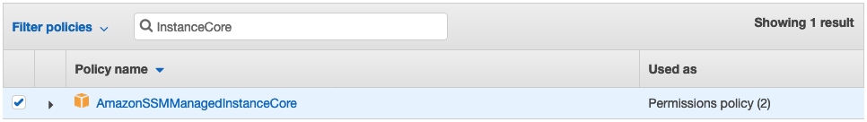
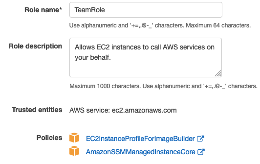

+++
title = "1.2 EC2 Instance Profile"
weight = 300
+++

## Intro

Because EC2 Image Builder uses EC2 instances to created an AMI, you need to use an [EC2 Instance Profile](https://docs.aws.amazon.com/IAM/latest/UserGuide/id_roles_use_switch-role-ec2_instance-profiles.html). When you use a role, you don't have to distribute long-term credentials (such as a user name and password or access keys) to an EC2 instance. Instead, **the role supplies temporary permissions** that applications can use when they **make calls to other AWS resources**.

**The IAM role** that **you associate** with your instance profile **must have permissions to run the build and test components** included in your image. For example, if you need to download a file from S3, you need to give the instance profile permission to do so.

As a starting point, use the following IAM role policies (you must attach both policies): **EC2InstanceProfileForImageBuilder** and **AmazonSSMManagedInstanceCore**.

{}
**You can SKIP this step if you are following this workshop via an AWS Hosted Event**. At an AWS hosted event you will be given a hash to login to [Event Engine](https://dashboard.eventengine.run). An AWS account will be provided that already has the EC2 Instance Profile named `TeamRole` created for you. You can continue to [2. Concepts]() if you are running this as part of an AWS event.
{}

## Create the role

**If you are running through this workshop using your own (or your employers) AWS account**, follow the below steps to create a Role and Instance Profile.

1. **Sign-in** to your AWS Account
2. Go to the **[IAM Console](https://console.aws.amazon.com/iam/home#/home)**
3. Click **'Roles'**
4. Click **'Create Role'**
5. Click '**AWS service**' and choose '**EC2**', click **next**.
6. On the Attach permissions policies, **search for** `AmazonSSMManagedInstanceCore` and select it.
   
7. Also search for `EC2InstanceProfileForImageBuilder` and select it as well.
8. Click Next, optionally tag your resource and click next again.
9. On the review screen, **give it a role name**, in this workshop **we will use** `TeamRole`.
   

## Let's explain what we just created

We've create **a role** that **can be assumed by an EC2 Instance**. This will provide temporary, auto rotating credentials.

The role has two policies attached **EC2InstanceProfileForImageBuilder** will allow the EC2 instance to write to [CloudWatchLogs](https://console.aws.amazon.com/cloudwatch/home?logsV2:log-groups#logsV2:log-groups) for debugging, but **only if** `LogGroupName` matches `/aws/imagebuilder/*`.

In the policy JSON, it looks like this:

```json
"Effect": "Allow",
"Action": [
    "logs:CreateLogStream",
    "logs:CreateLogGroup",
    "logs:PutLogEvents"
],
"Resource": "arn:aws:logs:*:*:log-group:/aws/imagebuilder/*"
```

It **will also allow the instance to get objects** from the **s3 buckets matching `ec2imagebuilder*`**. This is where AWS stores AWS managed components.

In the policy JSON, it looks like this:

```json
"Effect": "Allow",
"Action": [
    "s3:GetObject"
],
"Resource": "arn:aws:s3:::ec2imagebuilder*"
```

Finally, the **AmazonSSMManagedInstanceCore** policy enables an instance **to use AWS Systems Manager** service core functionality. EC2 Image Builder leverages AWS Systems Manager to run commands on the EC2 Instance used for building your golden AMI.
