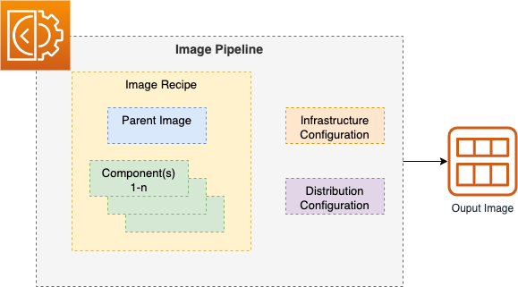

+++
title = "2.1 Image Pipeline"
weight = 100
+++

The **main component** is the **Image Pipeline** itself. A pipeline **needs at least** an **Image Recipe** and an **Infrastructure Configuration**.

