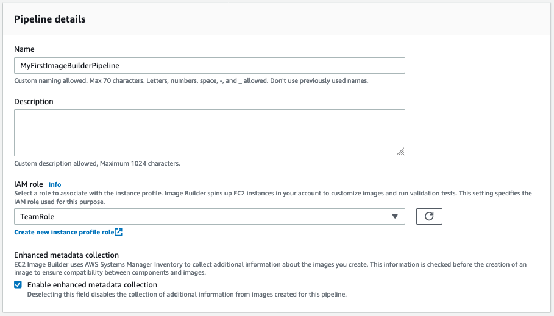

+++
title = "3.1 Creating an Image Pipeline"
weight = 100
+++

**Navigate to** the {}EC2 Image Builder Console{}

1. Click **Create Image Pipeline**.

This will bring you to the '**Specify pipeline details**' screen.

## Step 1 Specify pipeline details.

2. In the **General** section, enter a **Pipeline name**. We are going to use `my-first-pipeline`. Optionally specify a **Description** for the the pipeline. **Enhanced metadata collection** is turned on by default. To ensure compatibility between components and base images, keep it turned on.
3. In the **Build schedule** section, you can configure an interval to build your image. keep the default schedule.

{}
The expression determines how often EC2 Image Builder evaluates your pipeline Execution Start Condition. When we use the console that will default to `EXPRESSION_MATCH_ONLY`, this means Image Builder will build a new image every time the CRON expression matches the current time.
{}

4. At the bottom of the page, click **Next**.