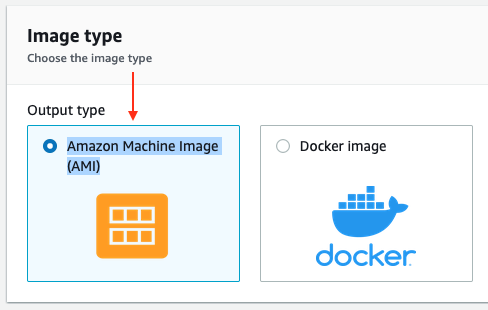
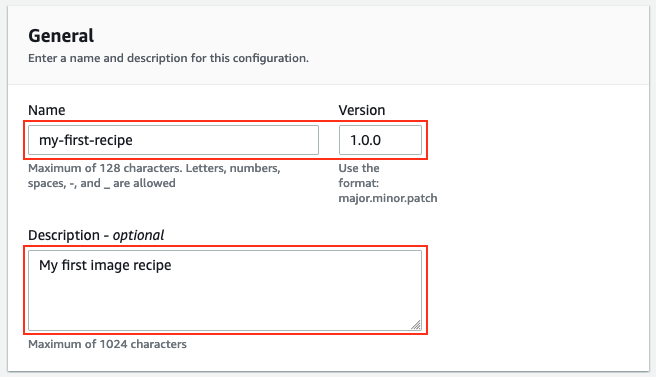
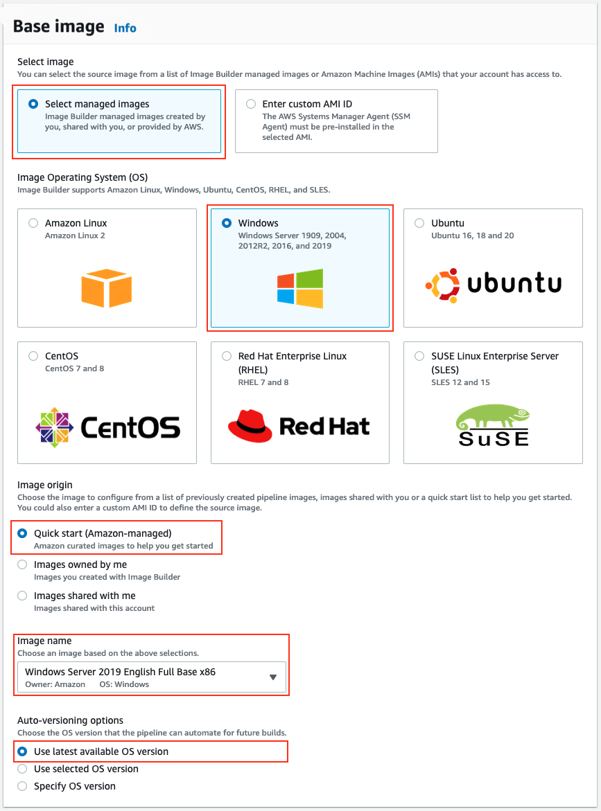

+++
title = "3.2 Choose recipe"
weight = 150
+++

An image recipe is a document that defines the components to be applied to the source images to create the desired configuration for the output image. After a recipe has been created, it cannot be modified. A new version must be created in order to change components.

   
1. Select **Create new recipe**.
2. For **Image type** select **Amazon Machine Image (AMI)**.

3. In **Gereral** enter a **Name, Version and Description** for your recipe.
   1. Name: `my-first-recipe`
   2. Description: `My first image recipe`

4. Under **Base image**, select **managed images** and **Windows**.
5. Select **Quick start (Amazon Managed)**.
6. For **Image Name** select **Windows Server 2019 English Full Base x86**.
7. Finally select **Use latest available OS version**.

This will use `/windows-server-2019-english-full-base-x86/x.x.x` as the image. **If** the **image semantic version** is configured as `x.x.x` **EC2 Image Builder will always use the latest available image** when the pipeline starts.

8. Under **Instance configuration** section, you can specify user data to configure an instance or run a configuration script during launch.

{}
When you provide user data, you must also ensure that the SSM agent is already installed on the base image or that you install it with your user data input.
{}

9. Under **Working directory** section, you can specify the working directory for use during build and test workflows. It defaults to C:/

Let's continue configuring build components.