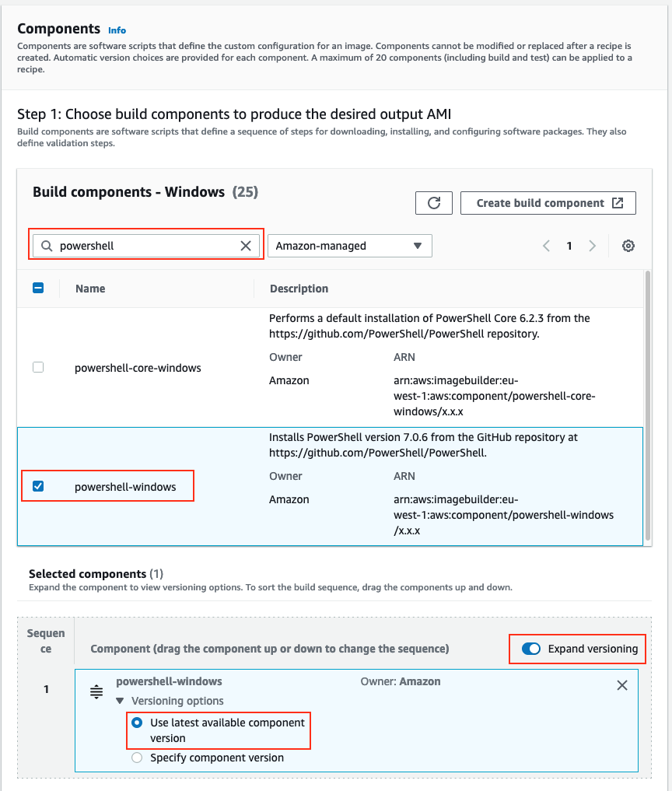
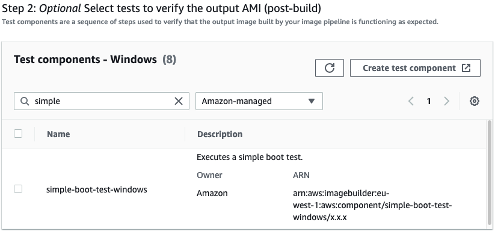

+++
title = "3.3 Adding Components"
weight = 200
+++

We will now add components to our AMI. In this example we'll use components provided by AWS. Later in the workshop we will build our own components.

{}
Need a refresher on components? Review the [Concepts: Image Recipe]() section.
{}

Let's start by adding [Powershell](https://github.com/PowerShell/PowerShell/releases/latest) to our image.

1. In the search field enter `powershell`.
2. Select `powershell-windows from the returned results`

Note there are **different versions of the component available**. Component version also **supports** the **`x.x.x` syntax**. By default, the console will reference the latest version. 

## Test Components

Let's add a test to make sure the instance is booting, and is able to generate a password.

3. Under '**Test components**' select `simple-boot-test-windows`

4. Finally, click **Next**