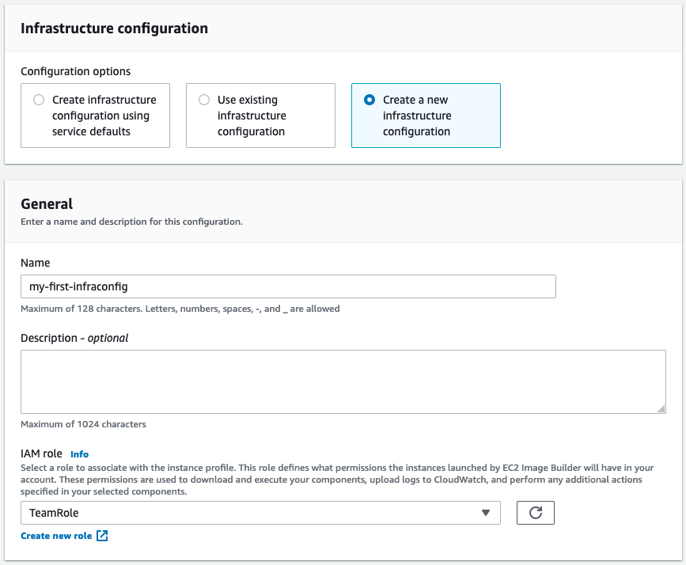
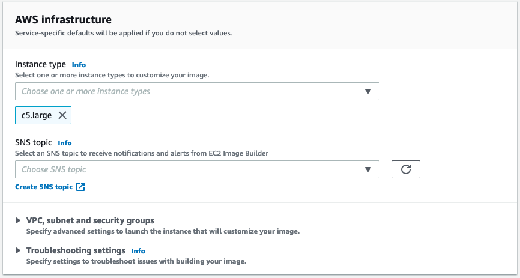

+++
title = "3.4 Infrastructure Configuration"
weight = 250
+++

Finally we need to set our **Infrastructure Configuration**. We will make some changes such as using a different IAM role and selecting a modern instance type. 

1. Select **Create a new infrastructure configuration**
2. **Give the configuration a name**
3. **Select the correct IAM Role**, this will give our build instance permissions such as sending logs to CloudWatch or grabbing files from s3.. 

{}
**If you don't know what the TeamRole is**, or if it doesn't exist in your account. **Review [Prerequisites: EC2 Instance Profile]()**
{}

## AWS Infrastructure

Finally we need to configure our AWS infrastructure settings. While these are optional, it's recommended to use modern instance types.

4. Go ahead and **add** `c5.large`.

Let's move to the final step, and create a distribution configuration.