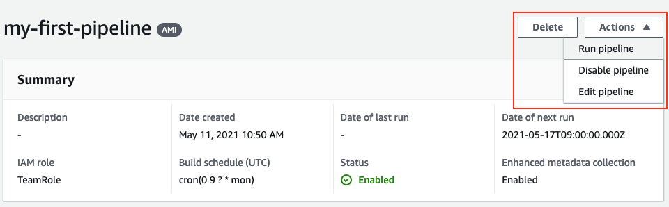
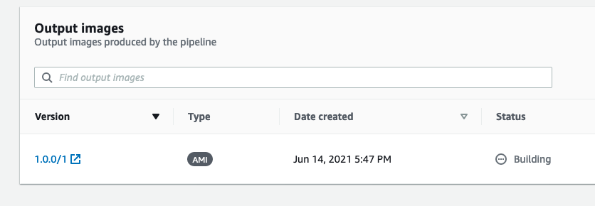
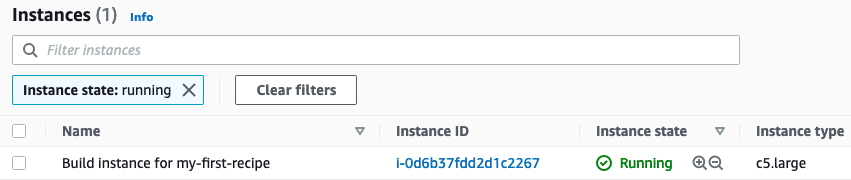

+++
title = "3.6 Run the pipeline!"
weight = 350
+++

1. **Navigate back to** the {}EC2 Image Builder Console{}
2. Click **'Image pipelines'**
3. Click **the pipeline you've created**.
4. Click **'Actions' -> 'Run pipeline'**

5. Now, again go back to the **'Image pipelines'** page, and **click your pipeline**.

You should now find you pipeline in **'pending'** or **'building'** **state**.

6. **Navigate to** the {}EC2 Console{}

Here you will soon find an ec2 instance that is being used for building the image.

