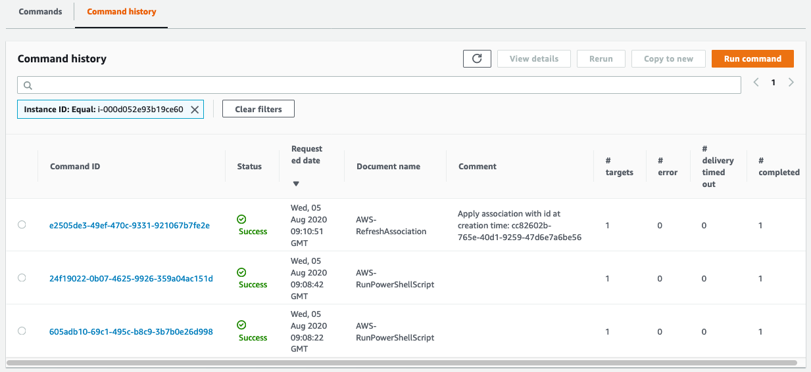
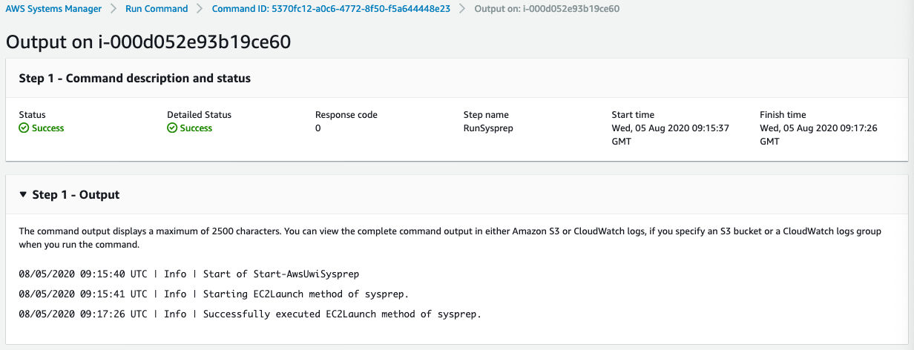

+++
title = "3.7.1 Under the hood: SSM"
weight = 400
+++

Now, let's find out what is happening under the hood.

## SSM

We already know that EC2 Image Builder is using an EC2 instance to create a new image. It **uses Systems Manager Run Command** to execute commands on the EC2 instance. We can confirm this as follows:

1. **Navigate to** the {}Systems Manager Console{}
2. On the left hand side, **click 'Run Command'**
3. Click **'Command history'**
4. **Optionally filter by instance-id**

This will show you the commands that have been run on the instance.

It will also **allow you to drill down**, and **find the exact output** of the specific command

