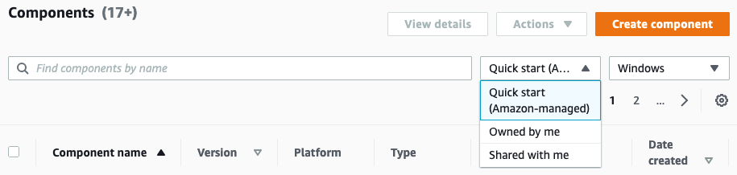
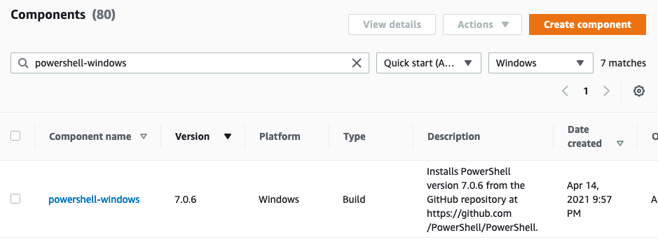

+++
title = "3.7.2 Under the hood: Document"
weight = 401
+++

Let's have a closer look at the component's that we have executed.

1. **Navigate back to** the {}EC2 Image Builder Console{}
2. Click **'Components'**
3. Select **'Quick start (Amazon Managed)'** and **'Windows'**

   

4. **Search for** `powershell-windows` and **sort ascending by version**.



5. **Click the same version you've perviously used** in your pipeline.

You will find that **the document has the following pattern:**

```yaml
phases:
  - name: build
    steps:
    - name: InstallerUri
        action: ExecutePowerShell
        onFailure: Abort
        timeoutSeconds: 5
        inputs:
        commands:
```

This component consists of a **build** **and** a **validate phase**, **multiple steps**, and **all steps execute one or more Powershell commands.**


The `ExecutePowerShell` action is called an [Action Module](https://docs.aws.amazon.com/imagebuilder/latest/userguide/image-builder-action-modules.html). Other actions include `Reboot`, `UpdateOS`, `S3download` etc, these action modules don't require you to write your own code.