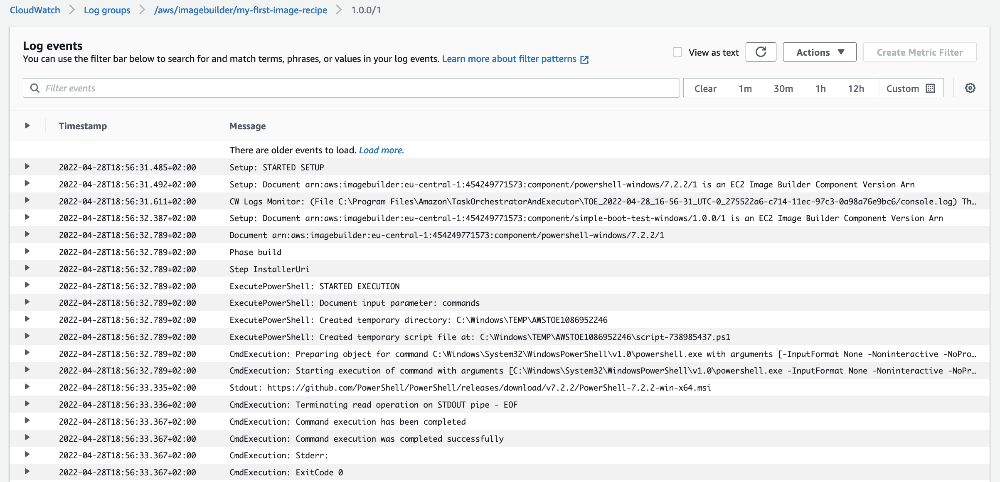

+++
title = "3.7.3 Under the hood: Logging"
weight = 402
+++

Now that we have an understanding of the Component/Document structure, let's see how that relates to the logs.

**By default, logs will be send to CloudWatch** logs. Optionally, you can also log to s3. Let's inspect the logs!

1. **Navigate to** the {}CloudWatch Console{}
2. Click **'Log groups'**
3. Find and Click the correct **Log Group**, it should look something like `/aws/imagebuilder/my-first-recipe`

You should find something like the below:

```log
Info Document arn:aws:imagebuilder:eu-west-1:643223756198:component/windows-is-ready-with-password-generation-test/1.0.1/1
Info Document arn:aws:imagebuilder:eu-west-1:643223756198:component/powershell-windows/7.2.2/1
Info Phase build
Info Step InstallerUri
Info Stdout: https://github.com/PowerShell/PowerShell/releases/download/v7.2.2/PowerShell-7.2.2-win-x64.msi
Info Command execution completed successfully
Info ExitCode 0
```

**Can you see how it relates to the Component we just reviewed?**

1. We see the documents we selected are downloaded.
2. Next the `build` phase is called.
3. The `Steps` are handled in chronological order.
4. The `Stdout` and optionally `Stderr` show the console output of the `ExecutePowerShell` action.
5. Finally **we see the exit code (0)**.

{}
The **exit code is important**! **If** commands throw a non-terminating error, the **exit code** will be `0` and **the pipeline will continue** executing.
{}

