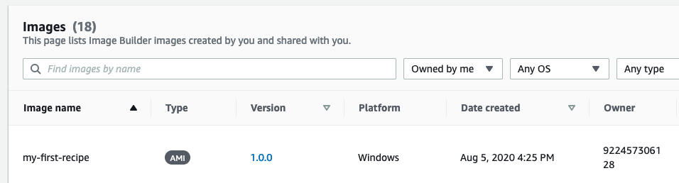
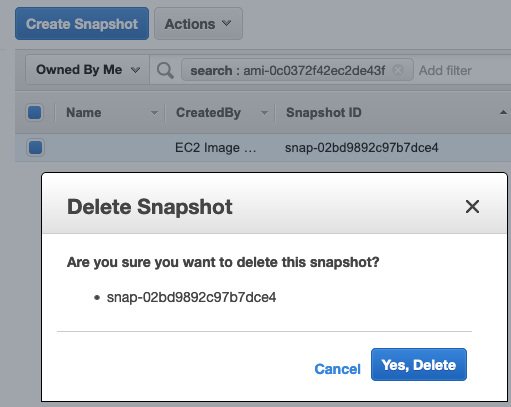

+++
title = "3.8 Clean-up"
weight = 999
+++

Let's confirm that our image is created successfully. We can view the created images in the [Images Section of the EC2 Image Builder Console](https://console.aws.amazon.com/imagebuilder#/images).

. 

We will now clean-up the resources we've created. 

1. Remain in the Images section.
   1. **Click** the `version` for your image.
   2. Select all versions.
   3. Click `Delete version`
   4. Type `Delete` to confirm.
2. Navigate to the EC2 console.
   1. Select AMIs
   2. Select the created AMI, it should have a similar name as your pipeline.
   3. **Copy the AMI ID**.
   4. Click `Actions -> Deregister -> Continue`
   5. Now go to `Snapshots`
   6. **Paste** the `AMI ID` in the **search field**.
   7. Select the Snapshots and click `Actions -> Delete -> Yes, Delete`

3. [Navigate to the pipelines in the EC2 Image Builder Console](https://console.aws.amazon.com/imagebuilder#/pipelines)
   1. **Select** the created `pipeline`.
   2. Click `Actions -> Delete`
   3. Type `Delete` to confirm.
   4. Click `Delete`
4. [Go to Image Recipes](https://console.aws.amazon.com/imagebuilder#/imageRecipes)
   1. **Select** the created `image recipe`.
   2. Click `Actions -> Delete`
   3. Type `Delete` to confirm.
   4. Click `Delete`
5. [Go to Distribution Settings](https://console.aws.amazon.com/imagebuilder#/distributionSettings)
   1. **Select** the created `distribution settings`.
   2. Click `Actions -> Delete`
   3. Type `Delete` to confirm.
   4. Click `Delete`
6. [Go to Infrastructure configurations](https://console.aws.amazon.com/imagebuilder#/infraConfigurations)
   1. **Select** the created `infrastructure configuration` settings.
   2. Click `Actions -> Delete`
   3. Type `Delete` to confirm.
   4. Click `Delete`